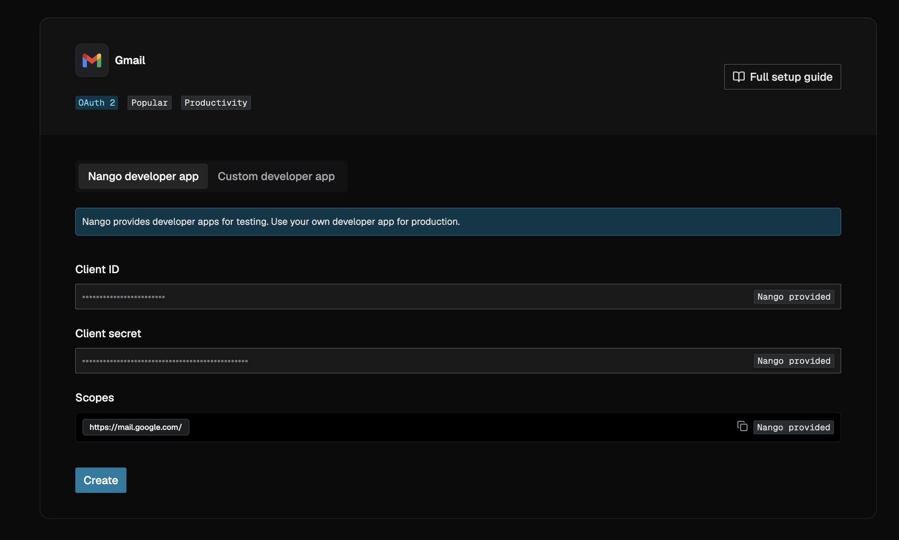
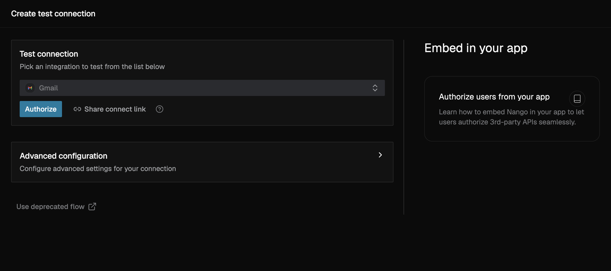
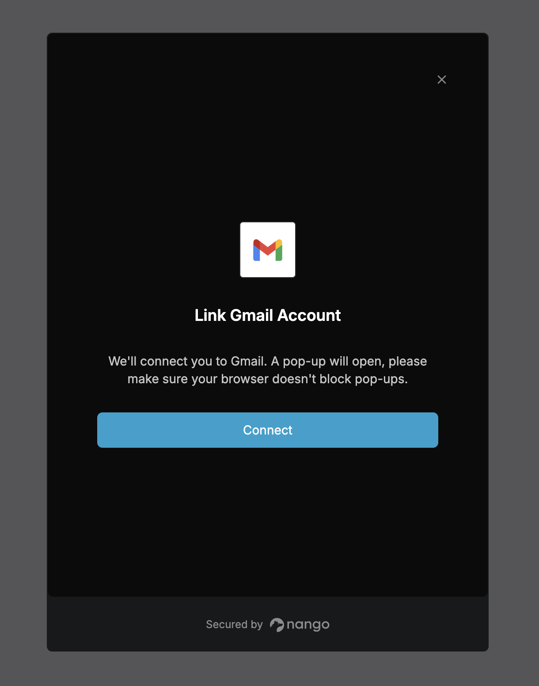
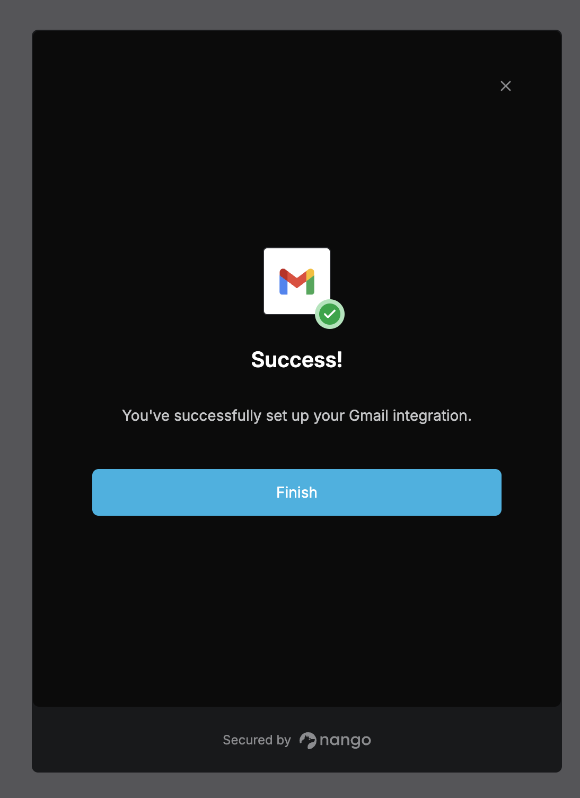
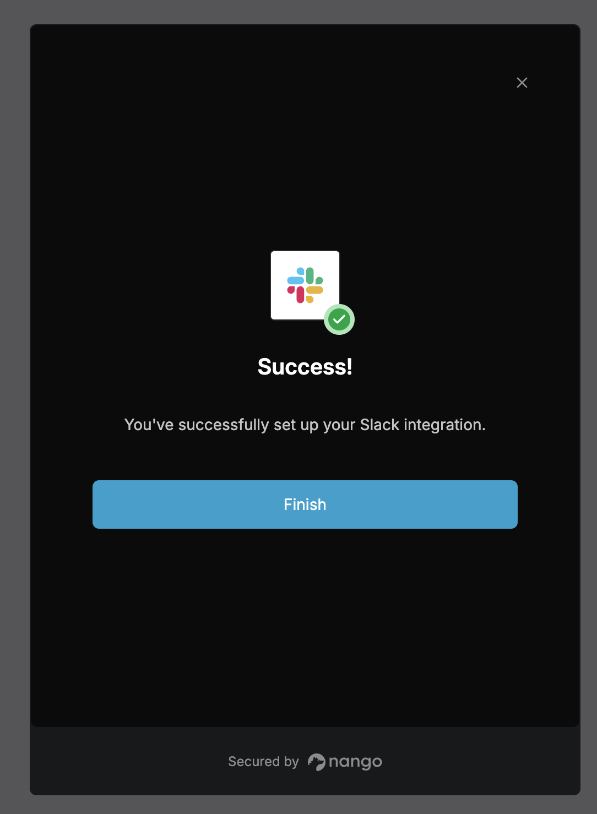
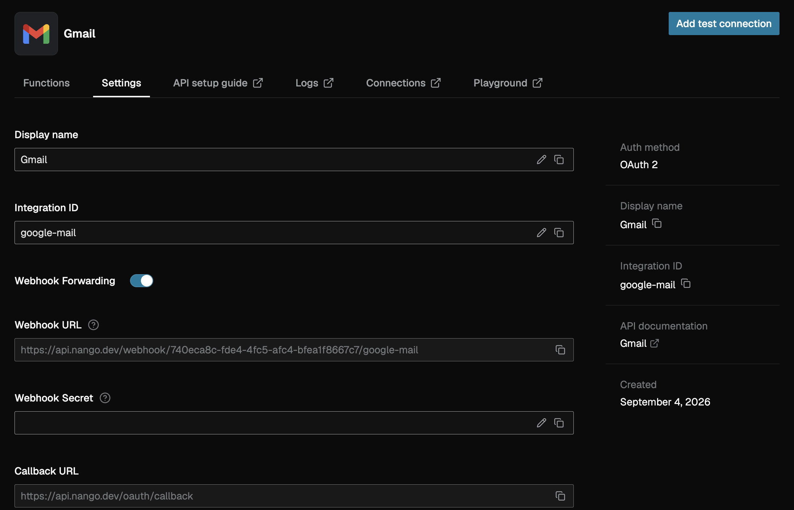
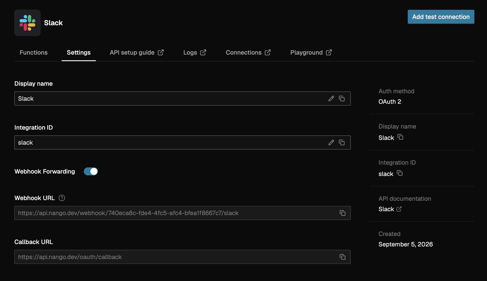
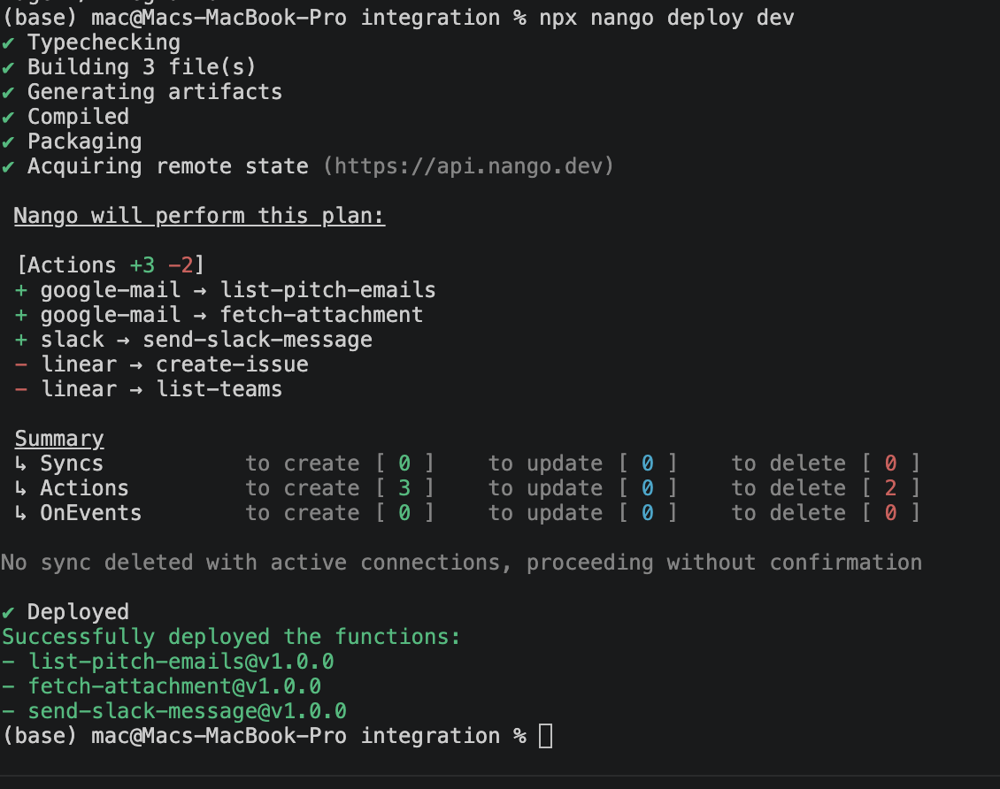
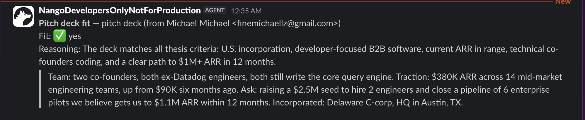

By the end of this guide, you will have:

- A Nango action that searches a Gmail inbox for pitch decks and pulls each one's PDF content out in a separate, explicit step.
- A LangGraph pipeline that judges every deck against a fixed investment thesis and returns a verdict grounded in a verbatim quote from the deck, not just a bare "yes."
- A Slack notification that fires only when a deck is a fit, built the same way as the Gmail action: a small Nango action, called directly from the graph.
- Five real issues hit building this, each with its cause and fix, in the Common issues table near the end - including one that only shows up once a model, not a human, is the one calling your action.



## Why is it hard to build an agentic triage pipeline like this?

Every piece of this sounds simple in isolation and gets genuinely fiddly once you wire it together.

You need two separate OAuth integrations - Gmail and Slack - each with its own token lifecycle, its own scopes, its own refresh flow. Get either wrong and the pipeline fails days later when a token expires, not during your first test.

Gmail's API does not hand you a pitch deck in one call. Searching an inbox returns message metadata; getting an attachment's actual bytes is a second, separate request keyed off an `attachmentId` the first call gave you. Skip that and your "PDF" is a filename with nothing behind it.

Getting a grounded, structured verdict out of an LLM is its own problem. It is easy to get a model to say "yes, this fits" - it is harder to get it to say why, and to prove the why by quoting the actual document rather than paraphrasing something it half-remembers from the prompt.

And once an LLM is involved at all, there is a design decision hiding in plain sight: should the model decide which tool to call at each step, or does your code already know the sequence and just need a safe way to call it? Get this wrong and you either build an agent for a problem that had no ambiguity to begin with, or you hardcode a sequence that breaks on the one case the model would have caught.

Two OAuth flows, a two-step attachment fetch, a schema for grounded output, and a tool-calling protocol - each one is a day of work if you build it yourself, before you've written any of the logic that actually triages a deck.

## Why use Nango for this

Nango gives you the OAuth flow, token storage, and refresh logic for Gmail and Slack out of the box - you connect an account once, in a hosted popup, and every call after that carries a valid token without your code touching it.

Nango's actions are small server-side functions you write once, with input and output validated against a schema you define. Deploy one and it's a versioned, callable endpoint - no separate service to run, no separate deploy pipeline.

Nango also exposes every deployed action as a tool on its own hosted MCP server, automatically. You do not stand up an MCP server, register tools by hand, or maintain a tool schema separately from your code - the schema Nango validates against is the same Zod schema your action already declares.

That last part matters for this build specifically: the plan here is for our own code, not a model, to decide which tool runs when. Nango's MCP server does not care which caller is on the other end - a model or a fixed pipeline can both call `tools/call` the same way. We are choosing not to hand a model the tool list, but the transport works either way.

## Prerequisites

- A Gmail account and a Slack workspace you can connect
- Node 22+
- A free [Nango](https://nango.dev) account
- An OpenAI API key with Structured Outputs access

## Installation

The repo has two independent projects: `integration` (the three Nango actions) and `graph` (the LangGraph pipeline that calls them). Clone it and install both:

```bash
git clone https://github.com/emmakodes/pitch-deck-triage-agent.git
cd pitch-deck-triage-agent

cd integration
npm install
cp .env.example .env

cd ../graph
npm install
cp .env.example .env
```

Both `.env` files stay empty for now - `integration/.env` needs your Nango secret key, `graph/.env` needs that same key plus the connection IDs and Slack channel you get from the next two sections.

## Connect your Gmail and Slack accounts

In the Nango dashboard, add both integrations first: **Integrations → Add Integration**, search for Gmail, and use the pre-filled "Nango developer app" tab shown above instead of registering your own OAuth app - the same screen, minus the icon, appears for Slack.

With both integrations created, each one needs an authorized connection before any code runs. Under each integration, click **Add test connection**, pick the provider, and authorize:







Do the same for Slack - same flow, same confirmation screen:



Each connection gets a connection ID. The actions below and the graph after them are both scoped to one connection ID per provider - that is what makes this safe to run against a real inbox and a real workspace rather than a shared service account.

## Build the Gmail actions

A Triage Run needs two things from Gmail: find a candidate email, then fetch its attachment. Those are two Nango actions, not one - matching the two separate Gmail API calls underneath.

```typescript
// google-mail/actions/list-pitch-emails.ts (trimmed - full attachment-walking
// loop and the rest of the output shape are in the repo)
import { createAction } from 'nango';
import * as z from 'zod';

const QUERY = 'has:attachment filename:pdf newer_than:30d';

const outputSchema = z.object({
    candidates: z.array(
        z.object({
            messageId: z.string(),
            threadId: z.string(),
            from: z.string(),
            subject: z.string(),
            attachmentId: z.string(),
            filename: z.string()
        })
    )
});

const action = createAction({
    description: 'List recent Gmail messages that have a PDF attachment.',
    version: '1.0.0',
    endpoint: { method: 'GET', path: '/gmail/pitch-emails', group: 'Triage' },
    input: z.object({}).strict(),
    output: outputSchema,

    exec: async (nango) => {
        const listRes = await nango.get({
            endpoint: '/gmail/v1/users/me/messages',
            params: { q: QUERY, maxResults: '5' }
        });
        // ... walk each message's payload.parts for an application/pdf part,
        // collect { messageId, threadId, from, subject, attachmentId, filename }
    }
});

export default action;
```

**Tip:** notice the input is `z.object({}).strict()`, not `z.void()`, even though this action takes nothing. There's a reason for that, and it only shows up once an MCP caller - not the CLI - is the one invoking it. It's the first row of the Common issues table below.

The second action fetches one attachment's raw content, given the IDs the first one returned:

```typescript
// google-mail/actions/fetch-attachment.ts
import { createAction } from 'nango';
import * as z from 'zod';

const action = createAction({
    description: "Fetch the raw content of one Gmail attachment.",
    version: '1.0.0',
    endpoint: { method: 'GET', path: '/gmail/attachment', group: 'Triage' },
    input: z.object({
        messageId: z.string().min(1),
        attachmentId: z.string().min(1)
    }),
    output: z.object({ data: z.string(), size: z.number() }),

    exec: async (nango, input) => {
        const res = await nango.get({
            endpoint: `/gmail/v1/users/me/messages/${input.messageId}/attachments/${input.attachmentId}`
        });
        return { data: res.data.data, size: res.data.size };
    }
});

export default action;
```

Gmail returns that `data` field base64url-encoded, not standard base64 - swap `-`/`_` for `+`/`/` before you decode it, or your PDF parser will fail on a file that looks fine in every other way.



## Build the Slack action

The notification is a third action, this time against Slack's `chat.postMessage`:

```typescript
// slack/actions/send-slack-message.ts
import { createAction } from 'nango';
import * as z from 'zod';

const action = createAction({
    description: 'Post a message to a Slack channel.',
    version: '1.0.0',
    endpoint: { method: 'POST', path: '/slack/messages', group: 'Triage' },
    input: z.object({ channel: z.string().min(1), text: z.string().min(1) }),
    output: z.object({ channel: z.string(), ts: z.string() }),

    exec: async (nango, input) => {
        const res = await nango.post({
            endpoint: '/chat.postMessage',
            retries: 0,
            data: { channel: input.channel, text: input.text }
        });

        if (!res.data.ok) {
            throw new nango.ActionError({ message: `Slack chat.postMessage failed: ${res.data.error}` });
        }
        return { channel: res.data.channel, ts: res.data.ts };
    }
});

export default action;
```

**Tip:** Slack's API answers `HTTP 200` even when a post fails, with the real error in `{ ok: false, error }`. Nango's retry logic keys off status codes, so it never sees this - check `ok` yourself, on every call, the way this action does.



All three actions live in one Nango project, so one command deploys all of them together:

```bash
cd integration
npx nango deploy dev
```



That `Actions +3 -2` line above is not a typo in this write-up - it is a screenshot of the actual first deploy of this project, and the two deletions are explained in the Common issues table below.

## Build the LangGraph pipeline

With all three actions deployed, the graph itself is short - this is the complete file (source comments trimmed for length, logic untouched). Each node calls exactly one named Nango tool - nothing here hands a model the tool list and asks it to choose:

```typescript
// graph/src/pipeline.ts
import { StateGraph, Annotation, START, END } from '@langchain/langgraph';
import type OpenAI from 'openai';
import { callNangoTool } from './mcp-client.ts';
import { extractPdfText } from './pdf.ts';
import { assessFit, type FitAssessment } from './assess.ts';
import { THESIS } from './thesis.ts';

interface EmailCandidate {
    messageId: string;
    threadId: string;
    from: string;
    subject: string;
    attachmentId: string;
    filename: string;
}

const TriageState = Annotation.Root({
    email: Annotation<EmailCandidate | null>({ reducer: (_prev, next) => next, default: () => null }),
    deckText: Annotation<string | null>({ reducer: (_prev, next) => next, default: () => null }),
    assessment: Annotation<FitAssessment | null>({ reducer: (_prev, next) => next, default: () => null }),
    notified: Annotation<boolean>({ reducer: (_prev, next) => next, default: () => false })
});

export interface GraphConfig {
    nangoSecretKey: string;
    gmailConnectionId: string;
    slackConnectionId: string;
    slackChannel: string;
    openai: OpenAI;
}

export function buildTriageGraph(config: GraphConfig) {
    const gmailScope = { connectionId: config.gmailConnectionId, providerConfigKey: 'google-mail' };
    const slackScope = { connectionId: config.slackConnectionId, providerConfigKey: 'slack' };

    const graph = new StateGraph(TriageState)
        .addNode('fetchEmail', async () => {
            const { candidates } = await callNangoTool<{ candidates: EmailCandidate[] }>(config.nangoSecretKey, gmailScope, 'list-pitch-emails', {});
            const email = candidates[0] ?? null;
            if (!email) {
                console.log('No candidate Pitch Deck email found - nothing to triage this run.');
            }
            return { email };
        })
        .addNode('fetchDeck', async (state) => {
            if (!state.email) {
                return {};
            }
            const { data } = await callNangoTool<{ data: string; size: number }>(config.nangoSecretKey, gmailScope, 'fetch-attachment', {
                messageId: state.email.messageId,
                attachmentId: state.email.attachmentId
            });
            const deckText = await extractPdfText(data);
            return { deckText };
        })
        .addNode('assess', async (state) => {
            if (!state.deckText) {
                return {};
            }
            const assessment = await assessFit(config.openai, THESIS, state.deckText);
            return { assessment };
        })
        .addNode('notify', async (state) => {
            if (!state.email || !state.assessment) {
                return {};
            }
            const text =
                `*Pitch deck fit* — ${state.email.subject} (from ${state.email.from})\n` +
                `Fit: ${state.assessment.fit ? '✅ yes' : '❌ no'}\n` +
                `Reasoning: ${state.assessment.reasoning}\n` +
                `> ${state.assessment.evidenceQuote}`;
            await callNangoTool(config.nangoSecretKey, slackScope, 'send-slack-message', { channel: config.slackChannel, text });
            return { notified: true };
        })
        .addEdge(START, 'fetchEmail')
        .addConditionalEdges('fetchEmail', (state) => (state.email ? 'fetchDeck' : END), { fetchDeck: 'fetchDeck', [END]: END })
        .addEdge('fetchDeck', 'assess')
        .addConditionalEdges('assess', (state) => (state.assessment?.fit ? 'notify' : END), { notify: 'notify', [END]: END })
        .addEdge('notify', END);

    return graph.compile();
}
```

Four nodes, two conditional edges: skip straight to `END` if there's no candidate email, and skip `notify` if the deck doesn't fit. `assessFit` is the only LLM call in the whole graph - a single OpenAI Structured Outputs call that returns `{ fit, reasoning, evidenceQuote }`, with the schema explicit that `evidenceQuote` has to be one contiguous span copied from the deck, not several sentences stitched together. Worth being that explicit: the first version of this schema, without that constraint, returned a quote that spliced two non-adjacent sentences together with "...". Technically an answer, not actually a quote.

`callNangoTool` is the small, hand-rolled MCP client that makes the `list-pitch-emails`, `fetch-attachment`, and `send-slack-message` calls above work - no SDK, under 100 lines. It opens a session against Nango's hosted MCP server (`https://api.nango.dev/mcp`), scoped to one connection via the `connection-id` and `provider-config-key` headers, and calls one tool by name. Complete file below, source comments trimmed for length:

```typescript
// graph/src/mcp-client.ts
const NANGO_MCP_URL = 'https://api.nango.dev/mcp';

export interface McpScope {
    connectionId: string;
    providerConfigKey: string;
}

interface JsonRpcResponse {
    jsonrpc: '2.0';
    id?: number;
    result?: unknown;
    error?: { code: number; message: string; data?: unknown };
}

interface McpToolResult {
    isError?: boolean;
    content?: { type: string; text?: string }[];
}

function headersFor(secretKey: string, scope: McpScope): Record<string, string> {
    return {
        'Content-Type': 'application/json',
        Accept: 'application/json, text/event-stream',
        Authorization: `Bearer ${secretKey}`,
        'connection-id': scope.connectionId,
        'provider-config-key': scope.providerConfigKey
    };
}

async function parseBody(res: Response): Promise<JsonRpcResponse | undefined> {
    const contentType = res.headers.get('content-type') ?? '';
    const body = await res.text();
    if (!body) {
        return undefined;
    }

    if (contentType.includes('text/event-stream')) {
        // SSE framing: one or more "data: <json>" lines - the response we
        // want is the last one.
        const dataLines = body
            .split('\n')
            .filter((line) => line.startsWith('data:'))
            .map((line) => line.slice('data:'.length).trim());
        const last = dataLines.at(-1);
        return last ? (JSON.parse(last) as JsonRpcResponse) : undefined;
    }

    return JSON.parse(body) as JsonRpcResponse;
}

let nextId = 1;

async function rpc(headers: Record<string, string>, method: string, params?: unknown): Promise<unknown> {
    const res = await fetch(NANGO_MCP_URL, {
        method: 'POST',
        headers,
        body: JSON.stringify({ jsonrpc: '2.0', id: nextId++, method, params })
    });
    if (!res.ok) {
        throw new Error(`MCP ${method} failed: HTTP ${res.status} ${await res.text()}`);
    }
    const parsed = await parseBody(res);
    if (parsed?.error) {
        throw new Error(`MCP ${method} error: ${JSON.stringify(parsed.error)}`);
    }
    return parsed?.result;
}

export async function callNangoTool<T = unknown>(secretKey: string, scope: McpScope, toolName: string, args: Record<string, unknown>): Promise<T> {
    const headers = headersFor(secretKey, scope);

    await rpc(headers, 'initialize', {
        protocolVersion: '2025-03-26',
        capabilities: {},
        clientInfo: { name: 'pitch-deck-triage-graph', version: '1.0.0' }
    });

    // Required notification - no response expected, fire and ignore.
    await fetch(NANGO_MCP_URL, {
        method: 'POST',
        headers,
        body: JSON.stringify({ jsonrpc: '2.0', method: 'notifications/initialized' })
    }).catch(() => undefined);

    const result = (await rpc(headers, 'tools/call', { name: toolName, arguments: args })) as McpToolResult | undefined;

    // MCP tool failures surface via `isError` on the result, not the
    // JSON-RPC error field checked in rpc() above - check both.
    if (result?.isError) {
        throw new Error(`Nango tool "${toolName}" failed: ${JSON.stringify(result.content)}`);
    }

    const textBlock = result?.content?.find((c) => c.type === 'text' && typeof c.text === 'string');
    if (!textBlock?.text) {
        throw new Error(`Nango tool "${toolName}" returned no text content: ${JSON.stringify(result)}`);
    }
    return JSON.parse(textBlock.text) as T;
}
```

This is the one part of the build with no worked example to copy from: most MCP write-ups either use a hosted agent runtime's built-in MCP client (letting OpenAI or Claude's platform own the wire protocol) or a full MCP SDK. Calling `tools/call` directly, from inside a LangGraph node, with a different `connection-id`/`provider-config-key` pair per provider, is a thinner path than either - and it worked against Nango's live server on the first real run, once the issues below were out of the way.

## Run a Triage Run

Fill in `graph/.env` with the connection IDs from the earlier step, your Nango secret key, your OpenAI key, and the Slack channel to notify - then wire it all up in the entry point:

```typescript
// graph/src/run.ts
import 'dotenv/config';
import OpenAI from 'openai';
import { buildTriageGraph } from './pipeline.ts';

function requireEnv(name: string): string {
    const v = process.env[name];
    if (!v) {
        throw new Error(`Missing env var ${name} - see .env.example`);
    }
    return v;
}

const openai = new OpenAI({ apiKey: requireEnv('OPENAI_API_KEY') });

const graph = buildTriageGraph({
    nangoSecretKey: requireEnv('NANGO_SECRET_KEY'),
    gmailConnectionId: requireEnv('NANGO_GMAIL_CONNECTION_ID'),
    slackConnectionId: requireEnv('NANGO_SLACK_CONNECTION_ID'),
    slackChannel: requireEnv('SLACK_CHANNEL'),
    openai
});

const started = Date.now();
const result = await graph.invoke({});
const elapsed = Date.now() - started;

console.log(`\n--- Triage Run (${elapsed} ms) ---`);
console.log(JSON.stringify(result, null, 2));
```

Email yourself a PDF pitch deck, then run it:

```bash
npm run triage
```

On a matching deck, this fetches the email, extracts the text, gets a Fit Assessment from OpenAI, and posts to Slack. Here's the real message from the first live run against `quantumleap-fit.pdf`:



## Common issues

| Issue | Cause and fix |
|---|---|
| `invalid_action_input: must be null` when an MCP tool with no input is called | Nango compiles a `z.void()` input schema to `{"type":"null"}`. An MCP `tools/call` always sends `arguments` as an object - `{}` for a no-input tool - which fails that schema under strict validation. Use `z.object({}).strict()` instead of `z.void()` for any action you plan to expose over MCP. |
| `SLACK_CHANNEL` environment variable reads as empty despite being set in `.env` | `dotenv` treats an unquoted `#` as a comment marker and drops everything after it - `SLACK_CHANNEL=#general` silently becomes an empty string. Quote it: `SLACK_CHANNEL="#general"`. |
| `nango deploy dev` deletes actions from an unrelated project | `nango deploy` replaces the whole environment's actions and syncs to match whatever's in the local folder you deploy from - it is scoped to the environment, not to the folder. Deploying two different local projects against the same secret key means the second deploy can silently remove the first project's actions. Use a separate Nango environment (or account) per project that shares no code. |
| A Triage Run picks the wrong email when more than one is waiting | Gmail's `messages.list` search order is not reliably newest-first. Code that assumes "the first result is the most recent" can act on an older message while a newer, more relevant one sits unprocessed behind it. Sort or filter explicitly on `internalDate` rather than trusting result order. |
| Running the same pipeline twice on the same email sends two notifications | Nothing in a stateless action remembers what it already processed. A search-based trigger like this needs its own idempotency key - checked and stored somewhere durable - if re-runs (a retry, a cron overlap, a manual re-trigger) shouldn't double-notify. |

## Conclusion

None of these five issues were in the LLM, and none were in LangGraph's graph logic either - the graph itself, once written, has run correctly every time. They were all in the seam between "what the code assumes" and "what the platform actually does under strict validation, under a shared environment, under a real inbox with more than one matching message." That is the part a screenshot of a passing demo run never shows you, and it is where most of the actual engineering time in a project like this goes.

The pattern generalizes past pitch decks. Any pipeline that reads an inbox, judges something against a rule, and tells a channel about it - support triage, lead routing, compliance review - hits some version of these same five issues, because they come from the platforms (Gmail, an LLM's honesty about its own output, a shared deploy target), not from the specific task.

Full code, the real run logs behind every claim above, and the fabricated sample decks used to test it: [github.com/emmakodes/pitch-deck-triage-agent](https://github.com/emmakodes/pitch-deck-triage-agent).

---

*Built with [Nango](https://nango.dev), [LangGraph](https://langchain-ai.github.io/langgraphjs/), and the OpenAI Structured Outputs API, with AI assistance in the debugging and the writing.*
